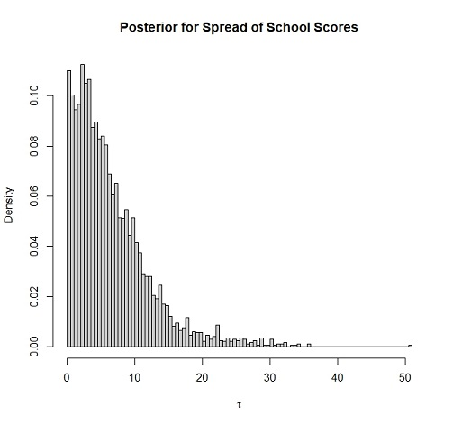

```{r setup, include = FALSE, echo = FALSE}
knitr::opts_chunk$set(warning = FALSE)
knitr::opts_chunk$set(message = FALSE)

library(grid)
library(gridExtra)
library(pander)
library(dplyr)
library(ggplot2)
library(effects)
library(ggfortify)
library(parallel)

panderOptions('missing', "-")

pander_lm <-function (fit, ...)
{
  fit.sum <- summary(fit)
  fit.coef <- fit.sum$coefficients
  fit.ttable <- matrix(nrow=length(fit.sum$aliased), ncol=4)
  colnames(fit.ttable) <- colnames(fit.sum$coefficients)
  rownames(fit.ttable) <- names(fit.sum$aliased)

  notna <- as.vector(which(!fit.sum$aliased))
  fit.ttable[notna,] <- fit.coef
  fit.ttable <- as.data.frame(fit.ttable)
  fit.ttable$`Pr(>|t|)` <- ifelse(fit.ttable$`Pr(>|t|)` < 0.0001, "<0.0001",
                                     sprintf("%.4f", fit.ttable$`Pr(>|t|)`))
  

  pander(fit.ttable, ...)
}

pander_anova <-function (fit, ...)
{
  fit.anova <- Anova(fit)
  fit.anova$`Pr(>F)` <- ifelse(fit.anova$`Pr(>F)` < 0.0001, "<0.0001",
                                  sprintf("%.4f", fit.anova$`Pr(>F)`))

pander(fit.anova, ...)
}

clust <- makeCluster(detectCores())

# Set seeds for cores (runs will always be the same).
clusterSetRNGStream(clust, 1800)

# Set seed for regular random number generation (for the non-parallel stuff)
set.seed(1800)
```

##  Does Social Justice Have a Place in Statistics?  

Social justice is a concept of _fair_ and _just_ relations between the individual and society.  

The concept of social justice has often referred to the process of _ensuring_ that individuals receive what is their due from society.

## Circularity  

### The efforts to understand social factors have the effect of emphasizing racial/ethnic/gender differences  

## Modeling Child IQ  
_National Longitudinal Survey of Youth, Gelman et. al_:  

```{r, echo = FALSE, fig.width = 8, fig.height = 4}
library(foreign)
library(pander)

kidiq <- read.dta("kidiq.dta")

fit.3 <- lm(kid_score ~ mom_hs* mom_iq, data = kidiq)

colors <- ifelse(kidiq$mom_hs == 1, "black", "gray")

par(mfrow = c(1, 1))
plot (kidiq$mom_iq, kidiq$kid_score, xlab = "Mother IQ score", ylab="Child IQ score", 
      col = colors, pch = 20)
curve (cbind (1, 1, x, 1*x) %*% coef(fit.3), add = TRUE, col = "black")
curve (cbind (1, 0, x, 0*x) %*% coef(fit.3), add = TRUE, col = "gray")
```

## Intelligence Factors  


  

## Model Shortfalls  

* __What social factors that impact a child's intelligence are absent from this statistical model?__  

* __How is circularity at play in these factors?__  


## Modeling Coaching Programs  

_8 Schools, Gelman et. al_:  

A study was performed for the Educational Testing Service to analyze the effects of special coaching programs on test scores. Separate randomized experiments were performed to estimate the effects of coaching programs for the SAT-V in each of eight high schools. The outcome variable in each study was the score on a special administration of the SAT-V, between 200 and 800. Also, there was no prior reason to believe that any of the eight programs was more effective than any other or that some were more similar in effect to each other than to any other.  

## Inference  {.smaller}
The problem is interested in the estimated coaching effects, $\bar{y}_j,$ and their sampling variances, $\sigma^2.$  


  

<!--  -->


```{r, echo = FALSE, message = FALSE, warning = FALSE, eval = FALSE}
library(rstan)
J <- 8
y <- c(28, 8, -3, 7, -1, 1, 18, 12)
sigma <- c(15, 10, 16, 11, 9, 11, 10, 18)
schools.fit <- stan(file = "8schools.stan", data = c("J", "y", "sigma"), iter = 1000, chains = 4)

schools.fit1 <- stan(fit = schools.fit, data = c("J", "y","sigma"), iter = 2000, chains = 4)
schools.sim <- extract(schools.fit1, permuted = TRUE) #combines chains and permutes values, after warmup

hist(schools.sim$mu, nclass = 100, col = gray(0.8), freq = FALSE, xlab = expression(mu), main = "Posterior for Mean of School Scores")
hist(schools.sim$tau, nclass = 100, col = gray(0.8), freq = FALSE, xlab = expression(tau), main = "Posterior for Spread of School Scores")
```

## Achievement Impacts  


## Modeling Shortfalls  

* __What social factors that impact a child's achievement are absent from this statistical model?__  

* __How is circularity at play in these factors?__   

## Earnings  

_Survey of American Adults in 1990, Gelman et. al:_  

```{r, echo = FALSE}
library(foreign)
heights <- read.dta("heights.dta")

heights2 <- subset(heights, !is.na(log(earn)))

heights2$age <- 90 - heights2$yearbn                     # survey was conducted in 1990
heights2$age[heights2$age < 18] <- NA

heights2$eth <- ifelse(heights2$race == 2, "black", 
                       ifelse(heights2$hisp == 1, "hispanic", 
                              ifelse(heights2$race == 1, "white", 
                                     "other")))
heights2$female <- heights2$sex - 2

attach(heights2)

ok <- !is.na(earn+height+sex) & earn > 0  & yearbn > 25

heights.clean <- heights2[ok,]

M1 <- lm(log(earn) ~ height + eth + female, data = heights.clean)

summary(M1)$call
pander(summary(M1)$coefficients)
```

## Achievement Impacts  


## Modeling Shortfalls  

* __What social factors that impact a child's achievement are absent from this statistical model?__  

* __How is circularity at play in these factors?__   

## Modeling Achievement  

### If our goal is to increase a child's achievement then we must focus on contextual factors that we can plausibly manipulate (e.g. discrimination, education, pollution, socioeconomic status, etc.) unlike gender and race.  

## Model Construction Best Practices  

### Modelling measures should reflect the construct of interest (e.g. years of schooling $\neq$ education if quality of education differs)

